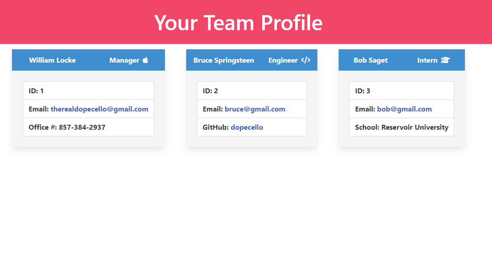

# Team Profile Generator 

## Description
Uses Node, Inquirer, OOP to generate a webpage of a team roster.
## Demonstration Video
https://www.youtube.com/watch?v=3mOKn3T1IWw
## Screenshot

## Table of Contents
* [Features](#features)
* [Languages & Dependencies](#languagesanddependencies)
* [How to Use This Application](#HowtoUseThisApplication)
* [Contributors](#contributors)
* [Testing](#testing)
* [Questions](#questions)
## Features
Made with Bulma
## Languages & Dependencies
jest, inquirer
## How to Use This Application:
ES6 JavaScript
## Contributors

## Testing
npm i && npm run test
## Questions
Please send your questions [here](mailto:william@fleato.com?subject=[GitHub]%20Dev%20Connect) or visit [github/dopecello](https://github.com/dopecello).
